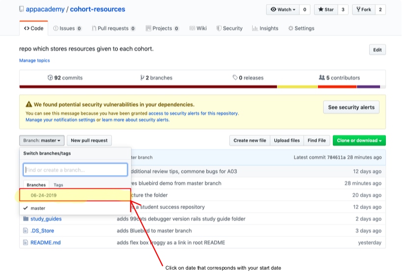
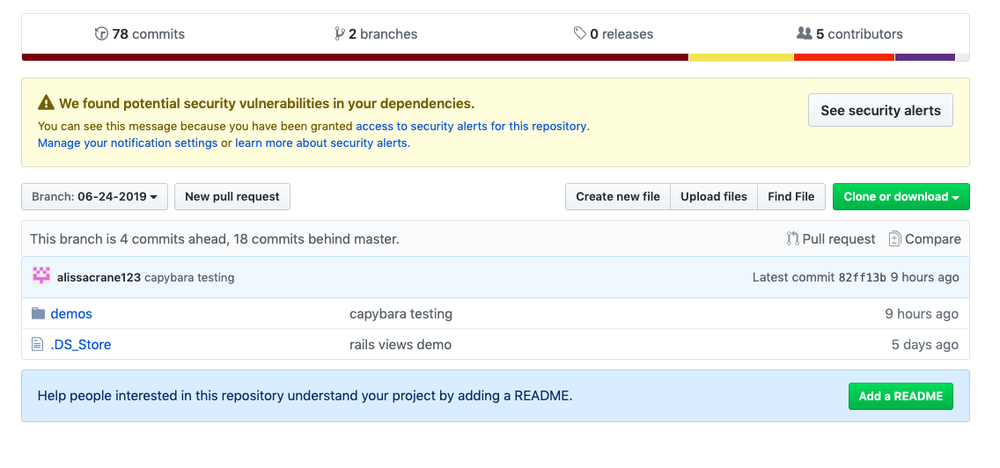

# Welcome to App Academy! 

Here you will find all resources which will be given out throughout your time here at appacademy. In order to preview the markdown files in vs code press (control + shift + m). Each cohort's branch will only have one folder that houses all demos done in lecture. ALL OTHER RESOURCES WILL BE STORED IN THE MASTER BRANCH. If you haven't learned git yet then use this [Without Git](#without-git). Otherwise, use [How to Use Repository](#how-to-use-repository) as it serves for both students and instructors. There is also two other section which serve for students and instructors respectively. 

* [Student Section](#student-section)
* [Instructor Section](#instructor-section)

## How To Use Repository
* Clone this repository in order to have access to all resources provided throughout the cohort:``` git clone <url>```.
* DO NOT GIT INIT ONCE YOUVE CLONED THIS REPOSITORY. When you clone, all commits are preserved.
* Once cloned, if you type git branch -r, you should be able to see different branches with dates.  Look for the date which corresponds with YOUR start date and begin to track that branch: ```git checkout --track origin/<month-day-year>```. Here is where all of the respective cohort lecture demos will live.
* You can type ``` git branch ``` to see that your cohorts branch is now there and being tracked.
* Each cohort's branch will only have one folder that houses all demos done in lecture 
* ALL OTHER RESOURCES WILL BE STORED IN THE MASTER BRANCH 
* In order to have the demos from lectures you must checkout your cohorts branch ``` git checkout <month-day-year>```and run ```git pull```.
* If there are changes done to assessment_tips, foundations_remote, student_success, or study_guides you must go into master and run ```git pull``` to receive the changes.

# Student Section 
## Calendar 
https://docs.google.com/spreadsheets/d/1P8TwPa9M1SxUwWlCJktBhAk08PRx4Ls7ehC4R-G5Znw/edit?ts=5d0a7a17#gid=1556007678
## SF Lecture Notes Link 
https://github.com/appacademy/sf-lecture-notes
## Alumni Engagement Agreement
https://appacademy.io/alumni-engagement-agreement
## Tommy Video Link
https://github.com/appacademy/code_for_video_demos
## Flex Box Froggy
https://flexboxfroggy.com/

## Folder Breakdown  
### assessment_tips
* This folder is a compiliation of markdown files that list out tips and tricks for each assessment you will take during the in person portion.
### demos
* Remember you must go into your cohorts branch in order to see this folder ```git checkout <month-start_date-year>```.
* All demos performed during lecture can be found in this folder. 
### foundations_remote
* This folder compiles all of the study guides given during the foundations portion of app academy.
### student_success
* This folder serves as a center for tips on how to maximize your success during your time here at app academy. 
### study_guides
* We've compiled a series of markdown, javascript, ruby and sql files that summarize different concepts learned throughout the course.  Look in here when you need some syntax refreshness or some quick concept summaries!

## Instructor Contact Info 

* Darren 
    * deid@appacademy.io
* Ronil
    *  rbhatia@appacademy.io
* Jeniffer
    * jkennedy@appacademy.io
* Mike 
    * mmadsen@appacademy.io
* Andy 
    * aminucos@appacademy.io
* Angela 
    * atopchev@appacademy.io
* Alissa 
    * alissacrane123@gmail.com
* Vanessa
    * vchen@appacademy.io
* Dean 
    * dlacap@appacademy.io
* Carlos 
    * cgarcia@appacademy.io
* Elliot
    * ehumphrey@appacademy.io
* Ryan 
    * rmapa@appacademy.io
## Without Git





# Instructor Section

* Each cohort will have its own branch.  The master branch serves as the skeleton branch.  Whenever you want to make a new branch for a cohort, branch from the master branch and name it as such: ```git branch <month-start_day-year>```. 
* Make sure to then delete all other folders except the demos folder.
* Finally, ``` git push -u origin <month-start_date-year>``` to push all branches to the remote repository
    * This will track the branch in the remote repository 
* Each cohort branch will only house the demos folder. This is done for maintainability reasons.

## Demos

*  Demos from lecture live within the demos repository.  For every demo, checkout the appropriate branch for the cohort ```git checkout <month-start_date-year>```, cd into the demo directory, and create a folder that will house the demo ``` wXdX-(name of demo) ```.  After the demos completion, add,commit and push your work.