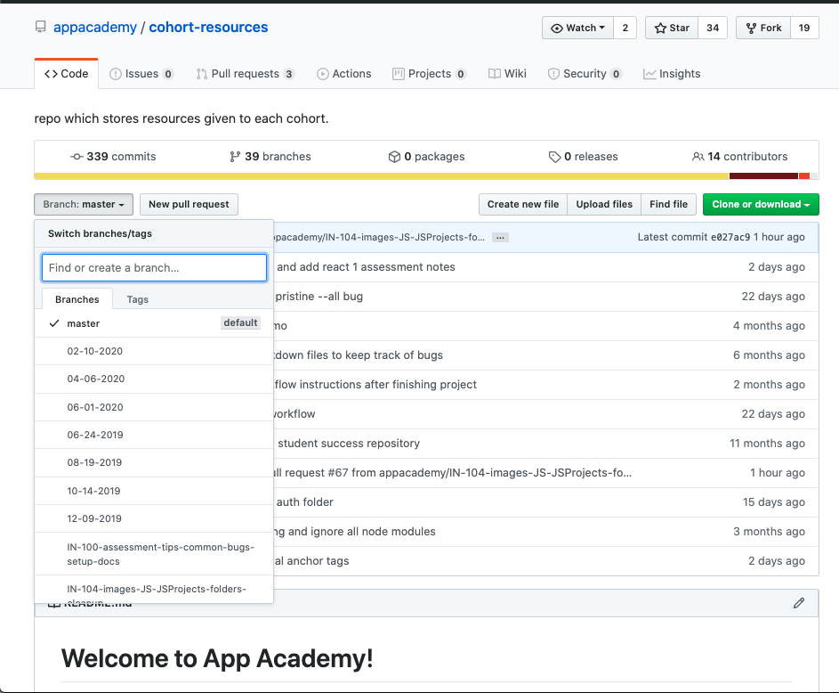
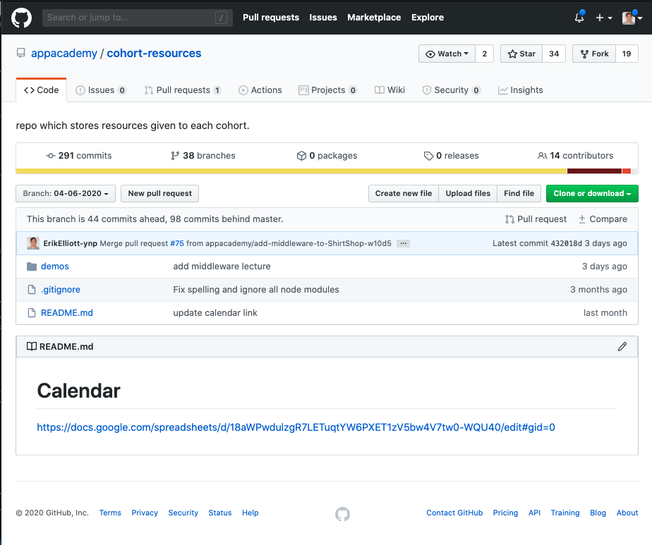
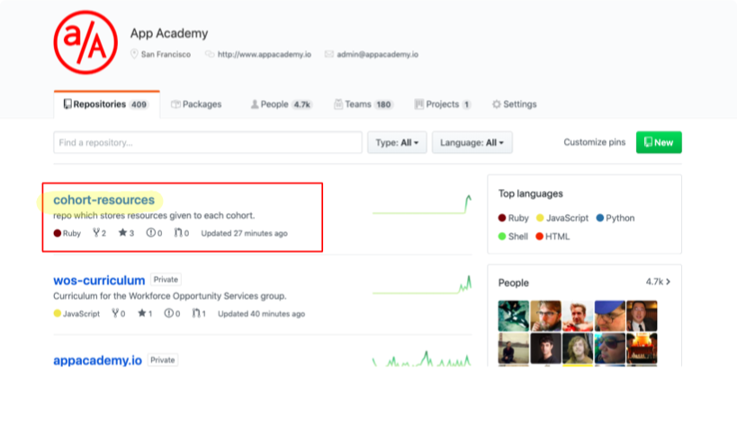
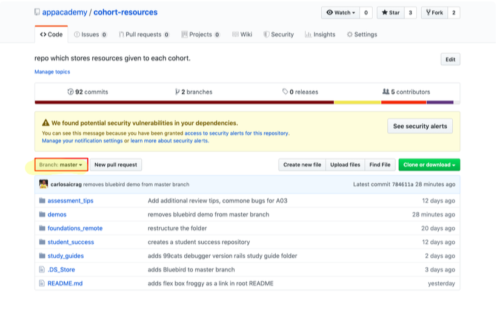
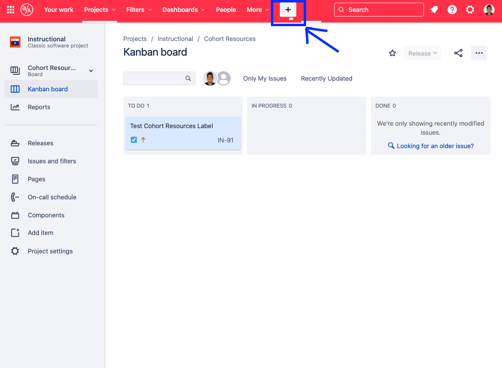
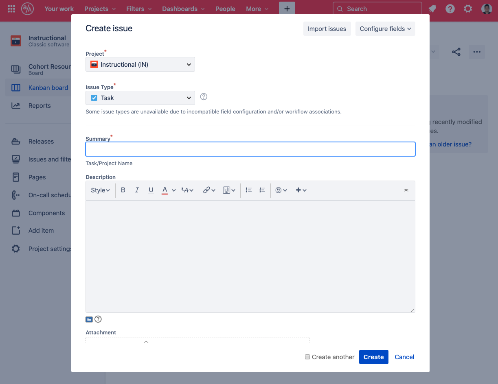
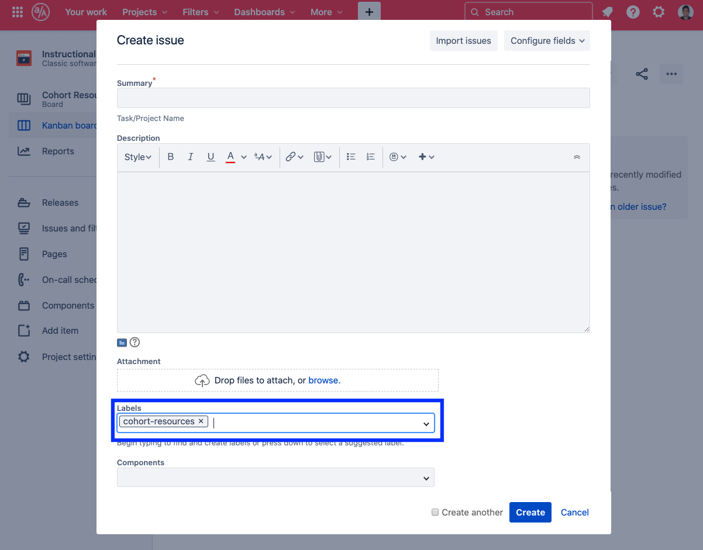

# Welcome to App Academy! 

Here you will find all resources which will be given out throughout your time here at appacademy. In order to preview the markdown files in vs code press (control + shift + m). Each cohort's branch will only have one folder that houses all lectures. ALL OTHER RESOURCES WILL BE STORED IN THE MASTER BRANCH. If you haven't learned git yet then use this [Without Git](#without-git). Otherwise, use [How to Use Repository](#how-to-use-repository) as it serves for both students and instructors. There is also two other section which serve for students and instructors respectively. 

* [Student Section](#student-section)
    + [Instructor Contact Info](#instructor-contact-info)
    + [Cohort Calendar](#cohort-calendar)
    + [Assessment Policy](#assessment-policy)
    + [Holidays](#holidays)
    + [Alumni Engagement Agreement](#alumni-engagement-agreement)
    + [Folder Breakdown](#folder-breakdown)
    + [Using this Repo without Git](#without-git)
* [Instructor Section](#instructor-section)
    + [Workflow](#workflow)
        * [Jira Workflow](#jira-workflow)
        * [Git Workflow](#git-workflow)
    + [Cohort-Lectures](#cohort-lectures)
    + [Multi-day Demos](#multi-day-demos)

## How To Use Repository
* Clone this repository in order to have access to all resources provided throughout the cohort:``` git clone <url>```.
* DO NOT GIT INIT ONCE YOUVE CLONED THIS REPOSITORY. When you clone, all commits are preserved.
* Once cloned, if you type git branch -r, you should be able to see different branches with dates.  Look for the date which corresponds with YOUR start date and begin to track that branch: ```git checkout --track origin/<month-day-year>```. Here is where all of the respective cohort lectures will live.
* You can type ``` git branch ``` to see that your cohorts branch is now there and being tracked.
* Each cohort's branch will only have one folder that houses all lectures
* ALL OTHER RESOURCES WILL BE STORED IN THE MASTER BRANCH 
* In order to have the demos from lectures you must checkout your cohorts branch ``` git checkout <month-day-year>```and run ```git pull```.
* If there are changes done to assessment_tips, foundations_remote, student_success, or study_guides you must go into master and run ```git pull``` to receive the changes.

# Student Section

## Instructor Contact Info 
### SF Instructors
* All Instructors 
    * instructors-sf@appacademy.io
* Bay Bridge Instructors
    * bay-bridge-instructors@appacademy.io
* Golden Gate Instructors 
    * golden-gate-instructors@appacademy.io
### NY Instructors
* All Instructors
    * instructors-ny@appacademy.io
* Madison Instructors
    * madison-instructors@appacademy.io
* Park Instructors 
    * park-instructors@appacademy.io

## Cohort Calendar
**Your Cohort's Calendar is found on the README of your Cohort's Branch**
1. To get there, go to the top of the page and click the branch dropdown 
2. Then, click on the branch with the name of your Cohort's start date
    + This process is shown in this image

3. The Calendar link will then be on the branch's README as shown in the image below


## Assessment Policy
* The App Academy Assessment Policy can be found [here](https://docs.google.com/document/d/1h_fKuhRYP5mGzTZrJHRyp9cpnBPlv5E7TjY_5pLZPNk/edit#).
    * For further questions, please reach out to your instructional team.

## Holidays 
* New Years Day 
* Martin Luther King, Jr Day
* Memorial Day
* Independence Day
* Labor Day
* ThanksGiving Holiday
* Winter Holiday 

## Alumni Engagement Agreement
https://appacademy.io/alumni-engagement-agreement

## Folder Breakdown  

### assessment_tips
* This folder is a compiliation of markdown files that list out tips and tricks for each assessment you will take during the in person portion.

### common_bugs 
* This folder has information on common bugs that you may encounter during your time at app academy.

### lectures
* Remember you must go into your cohorts branch in order to see this folder ```git checkout <month-start_date-year>```.
* All demos performed during lecture can be found in this folder.
* Lecture slides can also be found with this folder.

### environment_setup 
* this folder holds some information on setting up your environment.

### foundations_remote
* This folder compiles all of the study guides given during the foundations portion of app academy.

### student_success
* This folder serves as a center for tips on how to maximize your success during your time here at app academy. 

### study_guides
* We've compiled a series of markdown, javascript, ruby and sql files that summarize different concepts learned throughout the course.  Look in here when you need some syntax refreshness or some quick concept summaries!

## Without Git




# Instructor Section

* Each cohort will have its own branch.  The master branch serves as the skeleton branch.  Whenever you want to make a new branch for a cohort, branch from the master branch and name it as such: ```git branch <month-start_day-year>```. 
* Make sure to then delete all other folders except the lectures folder.
* Finally, ``` git push -u origin <month-start_date-year>``` to push all branches to the remote repository
    * This will track the branch in the remote repository 
* Each cohort branch will only house the lectures folder. This is done for maintainability reasons.

## Workflow
* So you want to contribute to cohort resources? you've come to the right spot
### Jira Workflow 
* [Jira Link](https://appacademyio.atlassian.net/secure/RapidBoard.jspa?rapidView=86&projectKey=IN&selectedIssue=IN-91)
#### Submitting a Ticket
* Submitting a ticket is quite easy. First create a new task on the Instructional Issues Backlog:
    
    


* There are a few necessary elements to include:

* label 
    
    * Please, make sure that you add the cohort-resources label.

* Summary
    * This is the 'at a glance' view of the issue being created. Please include the course where the issue is occurring as well as a terse description (~15 words or less) of what's going wrong.

    * Example: [CR] add study guide for active record

* Description
    * Here is your chance to explain the issue as best you can in as much detail as you can muster and give us everything we need to fix the issue. A few things MUST be present:

    1. a link to the place where the issue is happening or where you are adding something
    2. a description of what you observe and why this conflicts with what you think it should be
    3. priority, in your opinion (described below)
        * To make our life even easier please provide a screenshot if applicable or even a suggestion for how the problem should be solved.

* Estimating priority
    * Please set priority in line with the following guidelines:

    * lowest - fine if we never do it, might be an improvement
    * low - should probably do at some point, it's fine for now that students see it as is, no workarounds needed, recently out of date, typos in text. Small errors that students wouldn't be confused by.
    * medium - should do before next students see it, if possible, workarounds required. Typos level mistakes in code / solutions. Many students will have to ask questions to get through.
    * high - must do before next students see it, can only partially work around, partially incorrect information
    * highest - must fix ASAP, blocks student progress, offensive, blatantly wrong information

* What to expect
    * We on the cohort resources team meet regularly and prioritize issues to fix. We will evaluate them based on urgency and our availability.
    * When we do go over the issue, we might ask you questions about your issue. 

### Git Workflow 
* Before contributing please make sure that you follow the steps above to submit an issue and assign yourself to it once it has been placed in the selected for development section
* First of all, NEVER directly push to master or a cohorts branch.
* lectures will follow the instructions below [Cohort-Lectures](#cohort-lectures)
* ***Any contributions to the master branch will follow the following workflow***: 
#### Contributing
1. git pull (on master)
2. git checkout -b `IN-<jira issue number>-<abbreviated jira issue title>`
3. add contribution to the branch (add, commit, etc...)
    * commit messages must include the jira issue number. 
    * ``` git commit -m "IN-220 <this is what i did>"```
4. git checkout master 
5. git pull master
6. git checkout `<name of branch you're trying to contribute>`
7. git rebase master 
    * If you run into a merge conflict please contact a cohort resources branch manager. Branch managers can be found here: [Branch Managers](https://appacademyio.atlassian.net/wiki/spaces/IN/pages/804028585/Cohort+Resources)
8. git push 
    * do command that git tells you to do
9. create pull request on git
10. assign a reviewer (someone on cohort resources team) 
#### Reviewing 
1. make sure that after reviewing that you do not merge the request. Only branch managers will be allowed to merge requests. 

## Cohort-Lectures
*  lectures live within the lectures repository of the cohorts branch. If you are doing a lecture that uses a demo that spands multiple days please follow directions in [Multi-Day Demos](#Multi-day-Demos).  For every other lecture please follow these steps: 
1. checkout the appropriate branch for the cohort ```git checkout <month-start_date-year>```
2. git pull 
3. Create another branch that branches off from the cohorts branch that you just checked out.
    * ``` git checkout -b add-ajax-lecture-w9d4```
4. cd into the lectures directory, and create a folder that will house the demo and lecture slides ``` wXdX-(name of demo) ```. After the lectures completion, add, and commit work.
5. git push
    * do command that git tells you to do
6. On Github create pull request where the base is the cohort branch you're trying to merge into. Make sure that base is not master. 

7. Assign branch manager to review your pull request.

* If you run into any issues please contact cohort resources [Branch Managers](https://appacademyio.atlassian.net/wiki/spaces/IN/pages/804028585/Cohort+Resources)

## Multi-day Demos 
* Multi-day demos will live in their own repository.  In other words, they will not live within cohort resources.  A link should be placed in the lectures folder README that links students to the demos repository. Please make sure that you follow the instructions within [Cohort-Lectures](#cohort-lectures) upon placing the link. 

