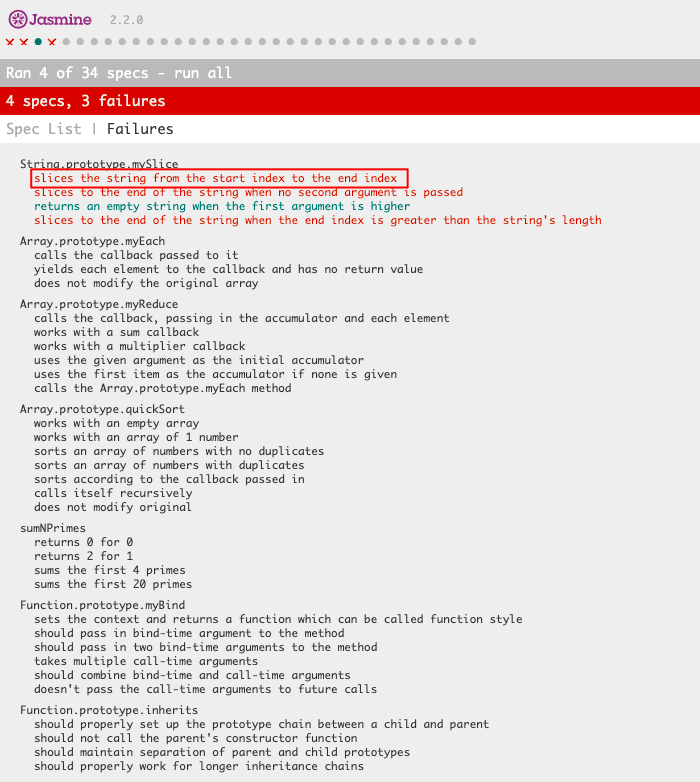

This document will help you understand how to navigate the specs during assessment 5.  Make sure to practice debugging using the techniques highlighted in this document.  The more practice, the better you'll be prepared to squash any bugs that appear on the assessment. 

* The image above shows what the total list of specs will look like.
* You can see that this is person is failing 3 out of the 4 specs in the mySlice function. 
* If I only wanted to test the specs for mySlice then I would press where the red box is. 

* After pressing the the red box you should only see the specs you are failing. Such as the picture above. 

* If you press the area where the red box is on the picture above then you will now be only testing one spec. 

* you should now see only one spec in the list of specs.  This is helpful as it allows you to test one spec at a time. 

* you can also test one spec at a time by clicking the area contained by the red box in the picture above. 
