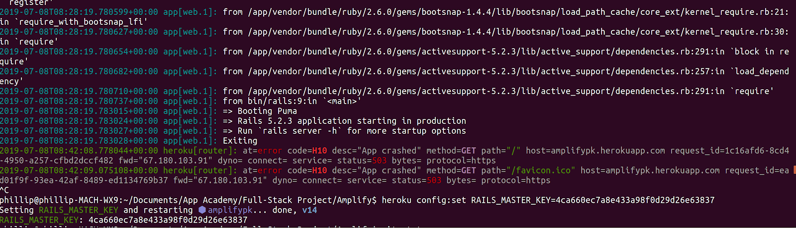
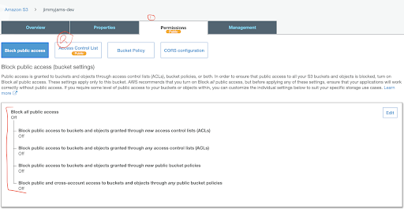

## Heroku Push Party Bug Fixes:

* TO-DO: Update this doc with the exact error messages which the following commands alleviate. 

Recipe for alleviating some Heroku push issues:

### Making sure Bundler is the correct version:

  - Gem uninstall bundler
  - Gem install bundler -v 2.0.2

### Push Failed:

  - `gem update —system`
  - `bundle install`
  - Commit the change 
  - Push to heroku  => `git push heroku master `

### Push Failed: 

- `rails assets:precompile RAILS_ENV=production`

# FSP Bugs (Please update as necessary):

|Bug Error Message and Image   |  How To Fix Bug  |
|---|---|
|  (Heroku) - H10 bug: |  1. Go to master.key 2. Copy key 3. Run the following command: `heroku config:set RAILS_MASTER_KEY= <paste-key-here>` |
|  ‘Actions must be plain objects. Must use custom middleware with thunk middleware’ (error happens in console not in webpack or server)  | 1. Go to store and import thunk from ‘redux-thunk’ 2. Add it to the store  |
|   (AWS) -  OpenUri::Forbidden::HTTP Error 403 Error (in terminal, while trying to seed) |   Make sure buckets are all public https://docs.aws.amazon.com/AmazonS3/latest/user-guide/block-public-access-bucket.html#block-public-access-bucket-one Permissions -> Block Public Access -> Off -> Turn on read and write access for public buckets. Permissions -> Access Control List -> Finally, make items inside buckets public by selecting all -> selecting the ‘actions’ drop down -> and selecting ‘Make Public’ |
|‘ActiveSupport::MessageEncryptor::InvalidMessage’| Make sure your heroku environment variables are set up correctly: `heroku config:set RAILS_MASTER_KEY=whatever is in your config/master.key file` |
| ‘Undefined method [] for nil (with active storage in stack trace)’ | Make sure your credentials are set up correctly: https://github.com/appacademy/curriculum/tree/master/full-stack-project/resources/ActiveStorageDemo#setting-up-active-storage.  If it still doesn’t work: -Make sure to reset the master key  -Check storage.yml & credentials:Edit command thing -Make sure they’re not .gitignoring something important |
| Hitting the browser’s back button doesn’t render the react component. Instead it doesn’t render anything despite placing debuggers in the respective container expected to render, and stopping at those debuggers. | SOLUTION: check their ‘application.js’ and make sure there is no sign of turbolinks. Note: turbolinks should be skipped when building a rails app that uses front end routing / React/Redux. |

* to untrack master key 
    * git rm -r --cached config/master.key
