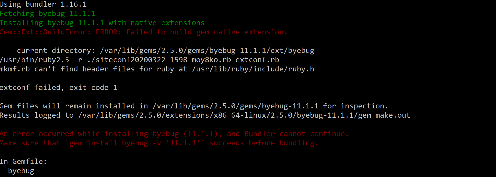

* https://stackoverflow.com/questions/4304438/gem-install-failed-to-build-gem-native-extension-cant-find-header-files 
* this is an issue on windows machines when trying to install the byebug gem
* if it doesnt fix when you do the command that they reccomend then try this: `apt-get install ruby-all-dev` 

* MacUserComputer:Gems z$ gem install pry
ERROR: While executing gem ... (Gem::FilePermissionError)
You don't have write permissions for the /Library/Ruby/Gems/2.3.0 directory.

** This is an issue with switching to zshell after having set-up with bash

** Test this by having student type `source ~/.bashrc` and running `pry`. If `pry` works here, it is a zshell error.

** The easiest fix is to switch back to `bash`. First have the student `cd` to root then type `chsh -s /bin/bash`. Opening a new terminal tab should show `bash` and not `zsh` at the top, and `pry` should now open successfully.
