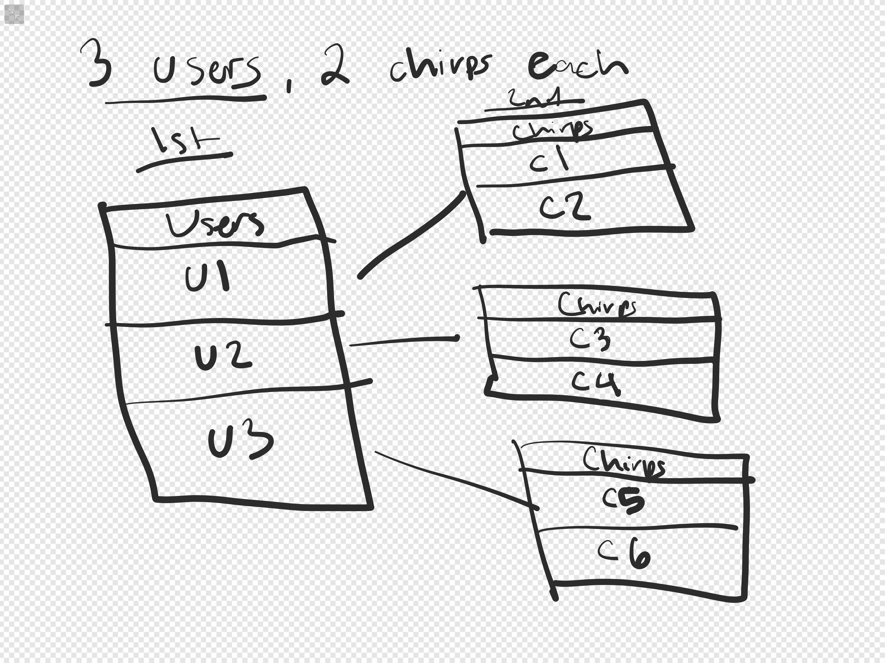
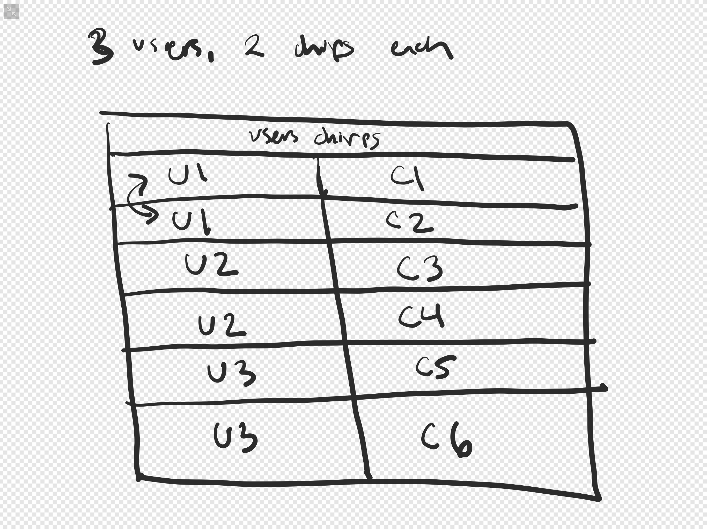
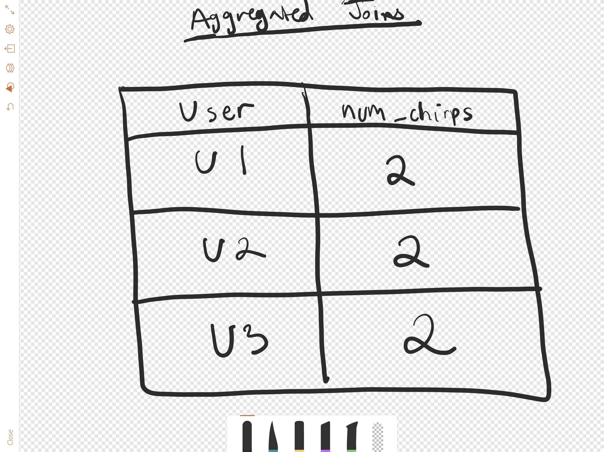

https://github.com/appacademy/sf-lecture-notes/tree/master/sql/w6d1-activerecord/demos

# find, find_by, all

# where and where.not 

# joins, left_outer_joins, distinct
```ruby
Chirp
    .joins(:author)
    .where(users: {username: 'Hermione Granger'})
# author is the association name
# users table, username is the column

# Find all chirps liked by people affiliated with Gryffindor
Chirp.joins(:likers).where(users: { political_affiliation: 'Gryffindor' })

# Find chirps written by 11-year olds also liked by 11-year olds 
Chirp.joins(:likers, :author).where(users: { age: 11 }).where(authors_chirps: { age: 11 })

# Find all chirps that Hermione likes 
Chirp.joins(:likers).where(users: { username: 'Hermione Granger' })

Chirp.joins(:likes, :author)

# Find all chirps with 0 likes 
Chirp.left_outer_joins(:likes).where(likes: { id: nil })
```

# select and pluck 
```ruby
Chirp.joins(:author).where(users: { username: 'Hermione Granger' } ).pluck(:body)

# select gives us an Active Relation 

# make sure to put .pluck at the end, since .pluck returns an array (not an Active Record relation)
# .where needs to work on an Active Record relation
```

# group 
```ruby
chirps = Chirp.select(:id, :body, "COUNT (*) AS NUM_LIKES").joins(:likes).group(:id)

chirps = Chirp.joins(:likes).group(:id).pluck(:id, :body, "COUNT (*) AS NUM_LIKES")
```

# having 
```ruby 
Chirp.joins(:likes).group(:id).having('COUNT (*) >= 3').pluck(:body, "COUNT (*) AS NUM_LIKES")
```

# order offset and limit 

# student challenge: find who is liking Nimbus's chirps the most 
```ruby
Chirp.select("users.username", "COUNT (*) AS num_likes" ).joins(:likers, :author).where(authors_chirps: { username: 'Nimbus'}).group("users.username").order("num_likes DESC")
```

# N+1 Queries and includes 

## includes 


## joins 


## aggregated joins
 

 