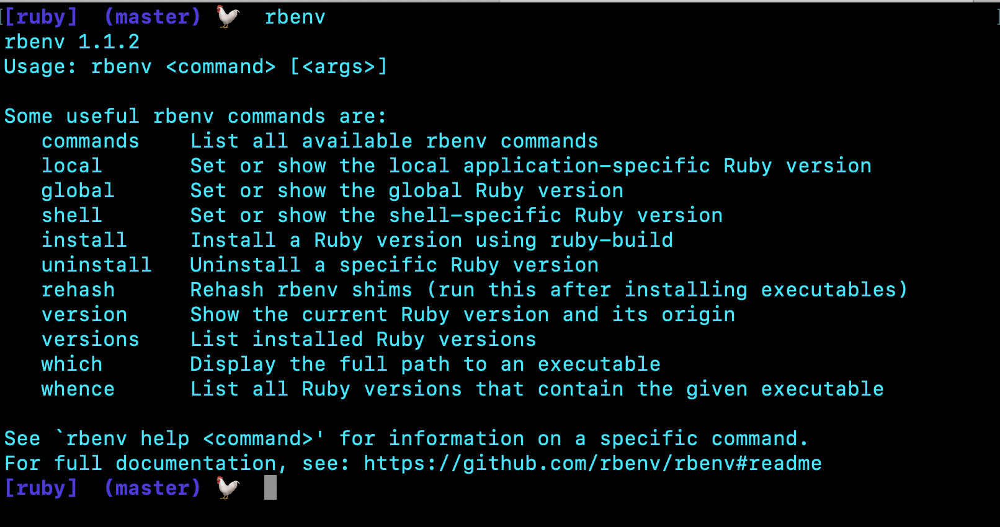

# rbenv 

* rbenv is super useful is helping developers manage their current ruby version. 
* after rbenv installation you can type in rbenv in your terminal to see the commands you can use



* for example if you wanted to change the global ruby version that you are using then you would use
```ruby
rbenv global (ruby version)
```

* if you wanted to see all the different versions of ruby that you have then you would do 
```ruby
rbenv versions 
```
