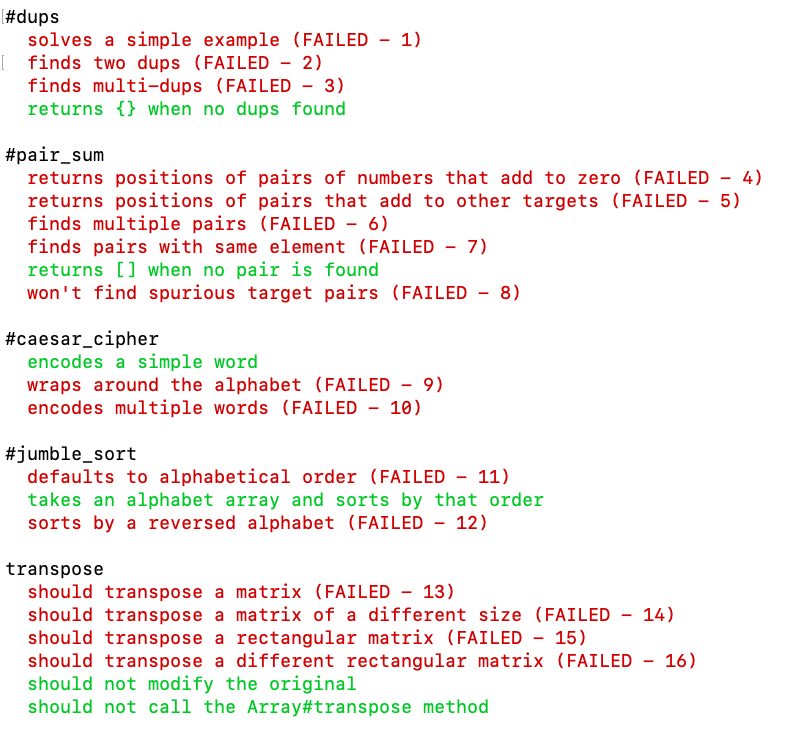

* Your first assessment is a spec based assessment which tests your knowledge on problem solving algorithmic problems.  The specs test the methods you have written.  Therefore, you can place debuggers in your code to see what your code is doing.


* this picture shows all of the specs that you have passed/failed. Green represent specs you have passed and red represent specs you have failed. 


* this picture gives an example of the type of error you will receive if you do not pass a spec. 'Expected' represents what the test expected to get and 'got' represents the output of the code you wrote. 


* At first this picture seems very useless, but it is actually one of the most important tools.  Each line of this picture represents a spec that you have failed. If you would like to test a specefic spec all you have to do is type 
```
bundle exec 
```
and then paste spec you want to test. 
```
bundle exec rspec ./spec/exercises_spec.rb:5
```


* This is what it looks like when you run just one test.


* Remember that you can always put multiple debuggers. You should strategically place debuggers at different parts of your code.  A good technique is to place a debugger at places you think your code is going wrong.  If it never hits the debugger, that means your code is never hitting that point.  Therefore, you should work backwards and see where it finally hits.  Once it finally hits your debugger, work your way through solving the problem. 


