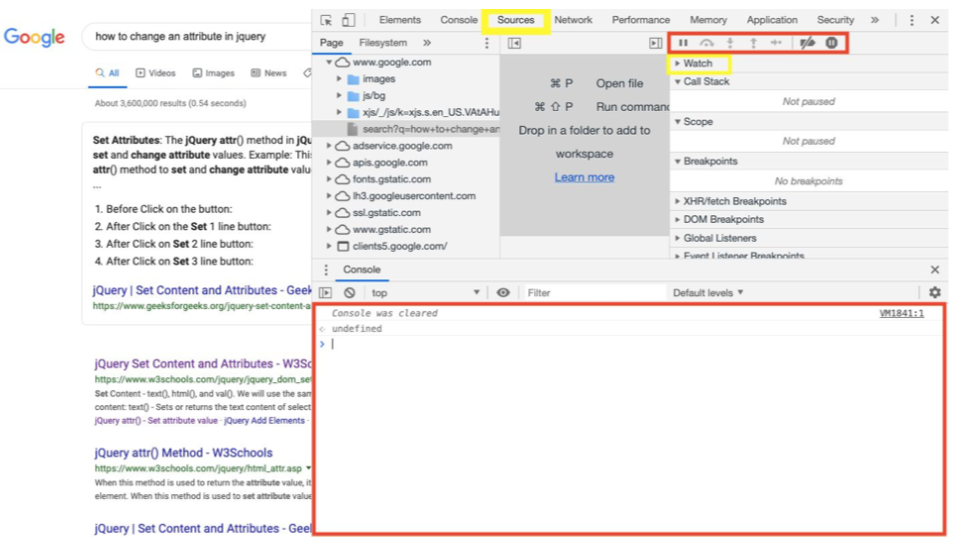
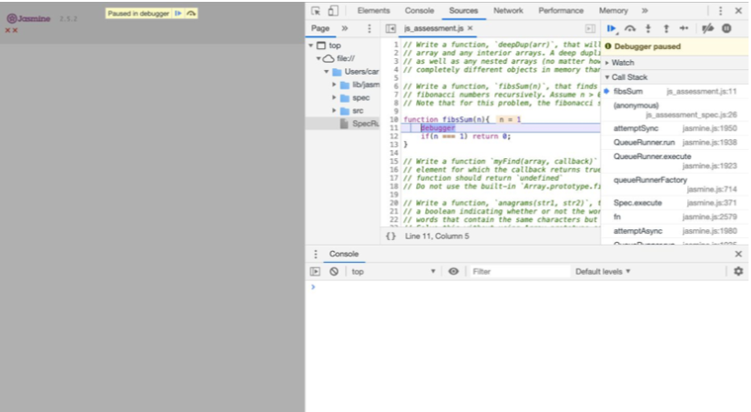

1. Command + Shift + i opens up developer tools palette

2. Switch to “Source” tab
3. Place a debugger in your code wherever you want to debug
4. Make sure to save your work and refresh the browser to begin the debugging process

Once you have placed your debugger in your code you should now see this:

* There are tools available to you in this palette that allow you to watch variables, step through sequentially through your code, and step into function that are called within the function you’re debugging. These are highlighted red in the first picture.
* Opening up the console drawer is also very helpful because it lets you write out quick math, and variables that you may want to check quickly. The big red box at the bottom of the first image in the console drawer.
* Make sure to become comfortable with this tool as it will not only help with A05 but with the rest of your front end development projects that you will encounter during your projects.