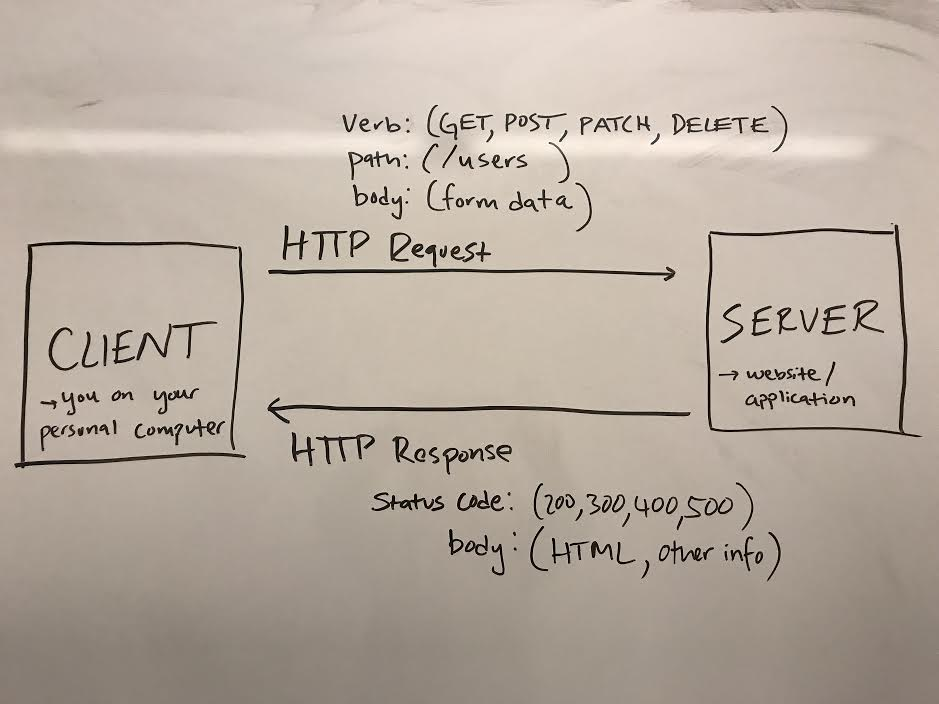
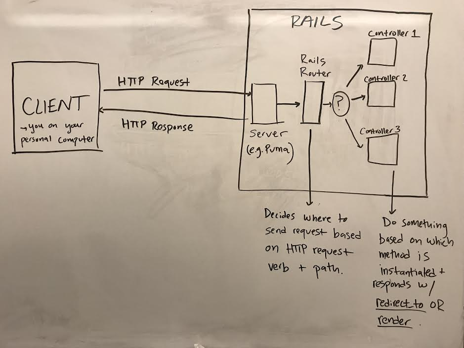
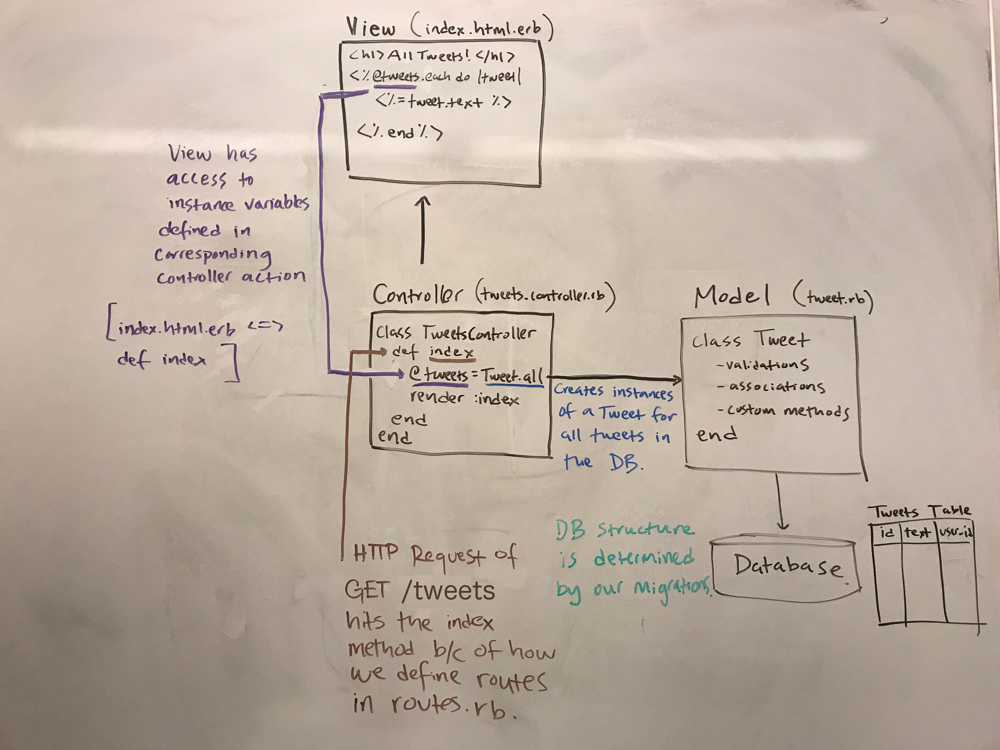
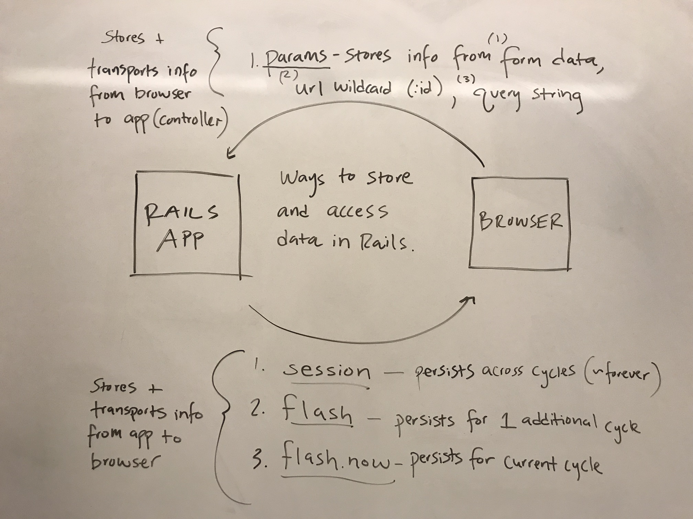

# Common User Auth Questions by Liz Houle

**This information can also be found [here](https://open.appacademy.io/learn/swe-in-person/rails/common-user-auth-questions) on App Academy Open**

### QUESTION: When do we use `before_action`?
`before_action` is considered to be a ‘filter’ in Rails ([Action Controller Overview — Ruby on Rails Guides](https://guides.rubyonrails.org/action_controller_overview.html#filters)), and it is a method that is run before a controller action (e.g. index, create, update, etc.) in the controller in which it is called. One common example of this is to pass before_action a method that ensures a user is signed in before being able to update or create something (e.g. post, comment, etc.). In the below code, the `before_action` is calling a method that ensures no user is currently logged in when we make a request to create a new user. If a current user exists, the `require_no_user!` method (defined in application_controller.rb) will redirect to a different page, and will not allow a request for a new user to be completed.


```ruby
class UsersController < ApplicationController
  before_action :require_no_user!

  def create
    @user = User.new(user_params)

    if @user.save
      login_user!(@user)
      redirect_to cats_url
    else
      flash.now[:errors] = @user.errors.full_messages
      render :new
    end
  end

  def new
    @user = User.new
    render :new
  end

  private

  def user_params
    params.require(:user).permit(:password, :username)
  end
end
```

#### SUBQUESTION: But what if I don't want the `require_no_user!` method to run before every action? What if I want any user (logged in or not) to be able to view users' profile pages?

Good news! Much like you can restrict the routes you generate in `routes.rb` by doing something like `resources :users, only: [:new, :create, :show]`, you can pass a hash with the key `:only` and an array of symbols (actions) as the value! (`:except` also works).

```ruby
class UsersController < ApplicationController
  before_action :require_no_user!, only: [:create, :new]

  def create
    @user = User.new(user_params)

    if @user.save
      login_user!(@user)
      redirect_to cats_url
    else
      flash.now[:errors] = @user.errors.full_messages
      render :new
    end
  end

  def new
    @user = User.new
    render :new
  end

  # require_no_user! will NOT be run before this method
  def show
    @user = User.find_by(id: params[:id])
    if @user
      render :show
    else
      redirect_to cats_url
    end
  end

  private

  def user_params
    params.require(:user).permit(:password, :username)
  end
end
```


### QUESTION: What’s the difference between `before_validation` and `after_initialize`?
`before_validation` is a method that will invoke another method before any of the other model validations are run (by calling `.save` or `.valid?`). `after_initialize` is a method that will invoke another method after an instance of a model is initialized (by calling `.new`).

```ruby
def User < ApplicationRecord
  after_initialize :some_custom_method
  before_validation :some_other_custom_method

  # Runs right after a User is initialized
  def some_custom_method
    # important code
  end

  # Runs right before a User instance is validated
  def some_other_custom_method
    # important code
  end

end

# This line of code initializes a new instance of a user by calling .new
# Once the user is initialized, the after_initialize will run the `some_custom_method` method
user1 = User.new(username: 'Liz', password: 'password')

# This line of code will run before_validation (in this case the `some_other_custom_method` method), and then all model validations
# Model validations are run when we call `.save` or `.valid?`
user1.save
```

**N.B** Most of the time it does not matter whether you use `before_validation` or `after_initialize`.


### QUESTION: Where do we put the logout button in Rails views?
We typically want the user to be able to see this on every page when navigating around the application. Thus, we put it in the `application.html.erb` file, which will always show this logout button at the top of the page if the user is logged in. You can think of the `application.html.erb` file as a root file for the rest of our views. Whatever is in this file will display, and then the view we are rendering will display below it where you see the line `<%= yield %>`.

```html
<body>
    <nav class="main-nav">
    <h1><a href="<%= cats_url %>">99 Cats</a></h1>
    <div>
    <% if current_user.nil? %>
      <a href="<%= new_session_url %>">Sign in</a>
      <a href="<%= new_user_url %>">Sign up</a>
    <% else %>
      <%= current_user.username %>

      # This is the logout button and it will
      # always be at the top of the page if the user
      # is logged in
      <form action="<%= session_url %>" method="post">
        <input
          type="hidden"
          name="authenticity_token"
          value="<%= form_authenticity_token %>">
        <input type="hidden" name="_method" value="delete">
        <input type="submit" value="Logout">
      </form>
    <% end %>
    </div>
    </nav>
    <main>
      <%= yield %>
    </main>
  </body>
```


### QUESTION: What is a session?
When we refer to a session, we are talking about the process of logging in and logging out on an application. Creating a new session is the same as logging in, and destroying a session is the same as logging out. Calling the `new` method in a session controller renders the `new.html.erb` view, which is the login page. In order to achieve this functionality in our applications, we must have RESTful routes to create and destroy our session, and render a login page. This means in our `routes.rb` file we define session routes like this

`resource :session, only: [:new, :create, :destroy]`

At this point in time, we use `resource` instead of `resources` because we are only allowing the user to have one session at a time. This means several things:
1. a user can only be logged in on one device at a time
2. we do not need a table for session
3. when we create and destroy a session, we do not need to provide an id
4. the routes will look like this

```
GET      /session/new   sessions#new
POST     /session       sessions#create
DELETE   /session       sessions#destroy
```

#### But what about the Rails session...
When we make a `POST` request to `/session` and call the `create` method in the `sessions_controller.rb` file, we want to attempt to log in the user whose information we entered in the login form. In order to log in a user, we must use the `session` that rails gives us. __This session is a place to store data during one request that can be read during later requests.__ We tell our application to compare the `session[:session_token]` value to our user's `session_token` value (saved in the user database) to determine whether a user is logged in or not. If `session[:session_token] == user.session_token`, then the user is logged in; otherwise, the user is logged out.

__A session is both (1) a general term representing the process of logging in/logging out AND (2) an object that rails gives us to store data that will persist across many request-response cycles.__


### QUESTION: Why do we have both database and model level validations?
Database level _constraints_ are truly the only thing protecting us from someone inserting unwanted information into the database. This is because a person could bypass our application and attempt to insert something directly into the database. However, if a database constraint fails, we throw a nasty 500-level error. Thus, model-level _validations_ are primarily for UI. If a user attempts to sign up, we want to be able to display a nice error message and have them try again, rather than going directly to the database, attempting to save a user, and getting a 500 error that disrupts our application. Model validations are run whenever we call `.save` or `.update` on the instance of our model. If these calls fail, we say that they `fail softly`. If we used `.save!` instead, then that would throw the database errors instead, and we would say that it `fails loudly`.

Consider the below code...

```ruby
def create
    @user = User.new(user_params)

    if @user.save
      login_user!(@user)
      redirect_to cats_url
    else
      flash.now[:errors] = @user.errors.full_messages
      render :new
    end
  end
```

If we used `@user.save!` instead of `@user.save`, we would never go into the else statement where we render errors. Instead, the database error would disrupt our application. Using `@user.save` allows us to go into the else statement if a model-level validation fails, and then we can show our use some nice error messages.

### QUESTION: What is the request-response cycle?
When a user is interacting with a browser, they do things such as click a button or type in a url and hit enter, which will initiate a request-response cycle. For example, if a user types `www.google.com` into a browser and presses enter, they will initiate an HTTP request, which is sent to google's server, which will decide what to do and how to respond to the request. The response will be sent back to the client (user's browser) and will update the browser accordingly.

__HTTP Requests__ - contain three major components
__Method__ (e.g. POST, GET, PATCH, DELETE)
__Path__ (e.g. /users)
__Body__ (e.g. username=lizbot)

__HTTP Responses__ - contain two major components
__Status Code__ (e.g. 200 - Success, 300 - Redirection, 400 - Client Error, 500 - Server Error)
__Body__ lots of information, typically contains HTML to be rendered on a page

Below is a diagram of a request-response cycle.



In __Rails__ land, Rails comes with its own server. When this server receives an HTTP request, it sends it to the __Rails Router__. This router takes in the request and decides where to send it - which controller and which method inside of that controller. For example, a `GET /users` would typically call the `index` method inside of `users_controller.rb`. __A new instance of a controller is instantiated for every single request-response cycle. Once a cycle is complete, the instance is destroyed.__ Side note: naming conventions are extremely important for Rails to figure out where to send requests. Below is a diagram of a request-response cycle in Rails.




### QUESTION: How do all of the MVC components connect?
1. __Migrations__ - these define the structure of our database. This is where we tell our application which tables and columns we want in our database and any database-level constraints (uniqueness, null, etc.). All table names are plural (e.g. `users`).
2. __Models__ (M of MVC) - every table in our database is represented by a model, and an instance of a model represents a single row in a table. The purpose of a model is to create ruby objects from information in our database so that we can interact with it in our application and perform basic CRUD operations. All model file and class names are singular (e.g. `user.rb` and `class User`).
3. __Routes__ (`routes.rb`) - these define the connection between an HTTP verb, url, and controller action. We often try to create RESTful routes.
4. __Controllers__ (C of MVC) - these take in HTTP requests, decide what to do with them, and how to respond. Each API endpoint (aka a resource you have defined in your routes.rb file) has it's own controller, and the methods inside of a controller should allow us to perform basic CRUD (create, read, update, delete) operations. The operation that is performed is determined by the method that is called. For example, an HTTP request of `POST /users`, should call the `create` method in the `UsersController`, which will create a new user and save it into the database. Every method in a controller must either `redirect_to` a url (`redirect_to users_url`) OR `render` a view (`render :new`).
5. __Views__ (V of MVC) - this is the HTML that a client sees in their browser. They use instance variables defined in the associated controller method (`index.html.erb` would have access to instance variables defined in the `index` method in the controller) to render information dynamically.

The below diagram illustrates the connections between the MVC components. The next question also provides details with respect to creating each one of theses components.




### QUESTION: How do we systematically set up the controllers and views? What’s the best way to build out logic in views vs. controllers? I want a checklist of how to setup my rails application!
We want to keep our controllers as slim as possible. This means we want to abstract a lot of code away from controllers into our models and into our application controller.

1. __Migrate__: Make a migration to create a table in your database (e.g. Posts). This involves deciding necessary columns and constraints.

Run this command
`rails g migration CreateCats`

It will create this file `/db/migrate/20180714033817_create_cats.rb`
```ruby
class CreateCats < ActiveRecord::Migration[5.1]
  def change
    create_table :cats do |t|
      t.date :birth_date, null: false
      t.string :color, null: false
      t.string :name, null: false
      t.string :sex, limit: 1, null: false
      t.integer :owner_id, null: false
      t.text :description

      t.timestamps
    end
  end
end
```

2. __Create a Model__: Create a model to represent this table (post.rb, class Post). This involves writing validations, associations, and any custom methods. An instance of a model is created every time we call `Cat.new`.

`cat.rb`
```ruby
class Cat < ApplicationRecord
  # freeze ensures that constants are immutable
  CAT_COLORS = %w(black white orange brown).freeze

  # N.B. Remember, Rails 5 automatically validates the presence of
  # belongs_to associations, so we can leave the validation of owner out
  # here.
  validates :birth_date, :color, :name, :sex, :owner, presence: true
  validates :color, inclusion: CAT_COLORS, unless: -> { color.blank? }
  validates :sex, inclusion: %w(M F), if: -> { sex }
  validate :birth_date_in_the_past, if: -> { birth_date }

  has_many :rental_requests,
    class_name: :CatRentalRequest,
    dependent: :destroy

  belongs_to :owner,
    class_name: 'User',
    foreign_key: :user_id
end
```

3. __Define Routes__: Determine which routes you want for your resource. If you only want someone to have the ability to create and delete a post, then you only need routes for `:create` and `:delete`.

```ruby
Rails.application.routes.draw do
  resources :cats, except: :destroy
end
```

4. __Create a Controller__: Create a controller with only the methods you need to match your existing routes. Each one of these methods will likley perform one of the basic CRUD operations. An instance of a model is often instantiated, manipulated, and then saved (or deleted) in the database in these controller methods. An instance of a controller is created and destroyed for every request-response cycle (HTTP request).

```ruby
class CatsController < ApplicationController
  # Allow unlogged in users to browse cats.
  before_action :require_user!, only: %i(new create edit update)

  def index
    @cats = Cat.all
    render :index
  end

  def show
    @cat = Cat.find(params[:id])
    render :show
  end

  def new
    @cat = Cat.new
    render :new
  end

  def create
    @cat = current_user.cats.new(cat_params)
    debugger
    if @cat.save
      redirect_to cat_url(@cat)
    else
      flash.now[:errors] = @cat.errors.full_messages
      render :new
    end
  end

  def edit
    @cat = current_user.cats.find(params[:id])
    render :edit
  end

  def update
    @cat = current_user.cats.find(params[:id])
    debugger
    if @cat.update_attributes(cat_params)
      redirect_to cat_url(@cat)
    else
      flash.now[:errors] = @cat.errors.full_messages
      render :edit
    end
  end

  private

  def cat_params
    params.require(:cat)
      .permit(:age, :birth_date, :color, :description, :name, :sex)
  end
end
```

5. __Create a View__: We only need to create views for pages that you would want to render for your application. Perhaps we want a page where a user can see all of the cats that exist in the database. This would likely be rendered from the `index` method in the `CatsController`, which means we would create a view `/cats/index.html.erb`. Inside of this view we would have access to the `@cats` instance variable defined above in the `index` method in the `CatsController`. __We use `<% %>` tags to write ruby code in our view files. If we want to actually render a value of a ruby variable to our screen from this file we can use the `<%= %>` tag__. We could create a view that looks like the following

```html
<section class="cat-index-holder">
  <nav>
    <h1>ALL OF THE CATS IN THE WORLD</h1>
  </nav>
  <section class="cat-index">
    # This is the same @cats as the @cats in the index method in the CatsController
    <% @cats.each do |cat| %>
      <div class="cat-index-item">
        <div>
          
          <br /><a href="<%= cat_url(cat) %>">Rent <%= cat.name %></a>
        </div>
      </div>
    <% end %>
  </section>
</section>
```

Perhaps we also want a page where a user can edit their cat in the cat database. This would likely be rendered from the `edit` method in the `CatsController`, which means we would create a view `/cats/edit.html.erb`. Inside of this view we would likely want a form where we can input/change our cat's information, and once we press the `submit` button, we will make an HTTP request with a method and path defined in our form, and a body that includes all of the data input in the form (name, birthdate, color, sex). The below form has some important components to note:
  - `action="<%= cat_url(@cat) %>"`, which defines the HTTP path (`/cats/:id`)
  - `method="post"`, which defines the HTTP verb (`POST`)
  - `<input type="hidden" name="_method" value="patch">` which overwrites the `POST` verb to be a `PATCH`. HTML forms are not allowed to have any other method besides `POST` or `GET`, and thus we must provide a hidden input to overwrite the method with the one we actually want. If you look at your params in your controller, once this form is submitted, params will have the key-value pair of `{"_method"="patch"}`.
  - `authenticity_token input`, which puts a key-value pair of `{"authenticity_token"="somerandomstring"}` in your params, which will tell rails the request is safe in order to protect against CSRF attacks.
  - the `name=` in all of the inputs merely designates under which key/keys that information is defined in your params. For example `name=cat[name]`, creates the following in your params `{"cat": {"name": "mycatsname"}}`.

```html
<form action="<%= cats_url %>" method="post">
  <input type="hidden" name="_method" value="patch">
  <input
    type="hidden"
    name="authenticity_token"
    value="<%= form_authenticity_token %>">

  <label for="cat_name">Name</label>
  <input
    type="text"
    name="cat[name]"
    id="cat_name"
    value="<%= cat.name %>">

  <br>

  <label for="cat_birth_date">Birth date</label>
  <input
    type="date"
    name="cat[birth_date]"
    id="cat_birth_date"
    value="<%= cat.birth_date %>">
  <br>

  <label for="cat_color">Color</label>
  <select name="cat[color]" id="cat_color">
    <option></option>
    <% Cat::CAT_COLORS.each do |color| %>
      <option
        <%= cat.color == color ? "selected" : "" %>
        value="<%= color %>">
        <%= color.upcase %>
      </option>
    <% end %>
  </select>
  <br>

  <input
    type="radio"
    name="cat[sex]"
    value="M"
    id="cat_sex_male"
    <%= cat.sex == "M" ? "checked" : "" %>>
  <label for="cat_sex_male">Male</label>
  <input
    type="radio"
    name="cat[sex]"
    value="F"
    id="cat_sex_female"
    <%= cat.sex == "F" ? "checked" : "" %>>
  <label for="cat_sex_female">Female</label>
  <br>
  <label>
    Description
    <textarea name="cat[description]"><%= cat.description %></textarea>
  </label>

  <br>
  <% submit_text = (cat.persisted? ? 'Update' : 'Create') + ' cat!' %>
  <input type="submit" value="<%= submit_text %>">
</form>
```

__Checklist for Rails MVC Setup__
- [ ] Initialize a rails project using postgres (`rails new myapp --database=postgresql`)
- [ ] Add necessary gems to the Gemfile and bundle (`bundle install`)
- [ ] Setup your project's database (`bundle exec rails db:setup`)
- [ ] Setup your database via migrations (`bundle exec rails g migration CreateCats`)
- [ ] Run your migrations (`bundle exec rails db:migrate`)
- [ ] Create models (one for each table in your database)
  - [ ] Add validations
  - [ ] Add associations
  - [ ] Add custom methods/validations
- [ ] Add routes to your `routes.rb` file that map your HTTP verb and url to specific controller actions
- [ ] Create controllers (one for each model)
- [ ] Create views (one for each page that you would want to render from your controllers)


### QUESTION: Params vs. Session vs. Flash vs. Flash.now
__params, session, flash, and flash.now are all places to store information in a rails application. What we store and how long that information is stored differs among these different storage options.__

The below storage option carries data from the browser to the application.
- `params`: these can come from three places (1) form data (2) a wildcard in a HTTP request url (3) a query string. We access data from our params in our controllers in order to complete the HTTP request.

The below storage options carry data from the application to the browser.
- `session` - the information stored in this persists for as long as we allow it. We use this to store cookie information and session_token information to determine whether users are logged in or logged out.
- `flash` - the information stored in this persists for one additional cycle after the current request-response cycle. We could use this in a situation where the user entered information into a form to create or update something, and for some reason the action fails, but we still want to display the entered information in the form after the error occurs.
- `flash.now` - the information stored in this only persists throughout the duration of the current request-response cycle. We typically use this to store error messages.

The below diagram illustrates how each of these storage options workd within Rails.




### QUESTION: Why would I nest a resource? How do I pass a foreign key into params if the resource is not nested?
It's common to have resources that are the 'children' of other "resources". Consider your application has these models

```ruby
# app/models/post.rb
class Post < ApplicationRecord
  has_many :comments
end

# app/models/comment.rb
class Comment < ApplicationRecord
  belongs_to :post
end
```

Nested routes allow you to capture this relationship in your routing. In this case, you could include this route declaration:

```ruby
# config/routes.rb
Bluebird::Application.routes.draw do
  resources :posts do
    # provides a route to create a comment for a given post.
    resources :comments, only: :post
  end
end
```

This generates a `/posts/:post_id/comments` route. Requests for this route will be sent to the CommentsController#create action. Let's take a look at the corresponding view and controller we could use to complete a `POST` request to `/posts/:post_id/comments`.

`/views/comments/new.html.erb`
```html
<h1>New Comment</h1>
<form class='form' action="<%= posts_url %>" method="post">
  <input
    type="hidden"
    name="authenticity_token"
    value="<%= form_authenticity_token %>">

  <label for='new-comment'>Comment</label>
  <input id='new-comment' type="text" name="comment[body]">

  <input type="submit" value="Submit">
</form>
```

```ruby
class CommentsController

  # When we make our POST request to /posts/:post_id/comments
  # Rails extracts the wildcard post_id from the path and
  # puts that information in our params under a top-level key.
  # The rest of your information should come from your 'Add Comment'
  # form. Your params will have the following structure
  # params: { post_id: 1, post: {body: 'this is my post'}}

  def create
    @comment = Comment.new(comment_params)
    @comment.post_id = comment_params
    if @comment.save
      redirect_to post_url(@comment.post_id)
    else
      flash.now[:errors] = @comment.errors.full_messages
      render :new
    end
  end

  def comment_params
    params.require(:comment).permit(:body)
  end
end
```

If we don't want to nest our resources, __what is another way we could get a foreign key into our params__? The answer to this is to put the `Add Comment` form in the `shot.html.erb` view for a `Post`. When we do this, we can include a __hidden input__ in the `Add Comment` form! Let's take a look at how we can accomplish this with a `POST` request to `/comments`.

`/views/posts/show.html.erb`
```html
<h1>This is my post!</h1>
  <h2>@post.text</h2>

  <h1>New Comment</h1>
  <form class='form' action="<%= comments_url %>" method="post">
    <input
      type="hidden"
      name="authenticity_token"
      value="<%= form_authenticity_token %>">

    # This hidden input passes our post_id into our params!
    <input type="hidden" name="comment[post_id]" value="<%= @post.id %>">

    <label for='new-comment'>Comment</label>
    <input id='new-comment' type="text" name="comment[body]">

    <input type="submit" value="Submit">
  </form>
```

```ruby
class CommentsController

  # When we make our POST request to /posts all of the information 
  # is now coming from the 'Add Comment' form, which is on the post show 
  # page. Your params will have the following structure
  # params: { post: {body: 'this is my post', post_id: 1}}

  def create
    @comment = Comment.new(comment_params)
    if @comment.save
      redirect_to post_url(@comment.post_id)
    else
      flash.now[:errors] = @comment.errors.full_messages
      render :new
    end
  end

  def comment_params
    params.require(:comment).permit(:body, :post_id)
  end
end
```

### QUESTION: What’s up with the password= and why do we have a reader on our password?
When we sign up or log in a user, we get a username and a password in our params;  however, we do not actually save the password in our users table in our database for security reasons. As a result, we need a way to convert our password into a password_digest (this is what we save in the database). We also want to still be able to validate our password (e.g. password length) even though it is not being saved in the database. In order to accomplish these two tasks (convert password to password_digest and validate our password), we write some additional methods in our User model.

When we call `.new` on a user and pass in params, our model must have attr_writers defined on the params that we pass.
```
user = User.new(username: 'Liz', password: 'password')
```
Since password is not a column in our table, ActiveRecord does not automatically create an attr_reader and attr_writer on password like it does for all of the columns in our table. As a result, we need to write our own attr_writer (`password=(password)`)for password in order to initialize a new instance of password with a password attribute. Inside of this method we do two things (1) set our user's password_digest, which will be saved in the database, and (2) set an instance variable `@password = password`. The only reason we need to set this instance variable is so that we can create a reader on our password (`attr_reader :password`), which is used in the password validation (`validates :password, length: { minimum: 6, allow_nil: true }`). In summary, the only reason we must create an instance variable and attr_reader for password is to validate the password. Additionally, the attr_writer (`password=(password)`) is used to set the password_digest attribute from the password.

`user.rb`
```ruby
class User < ApplicationRecord
  validates :username, presence: true, uniqueness: true
  # If a password was set, we validate it meets the requirements.
  # Note the `allow_nil`.
  validates :password, length: { minimum: 6, allow_nil: true }
  validates :password_digest, presence: true
  validates :session_token, presence: true, uniqueness: true

  attr_reader :password

  has_many :cats

  after_initialize :ensure_session_token

  def self.find_by_credentials(username, password)
    user = User.find_by(username: username)

    return nil if user.nil?
    user.is_password?(password) ? user : nil
  end

  def is_password?(password)
    BCrypt::Password.new(self.password_digest).is_password?(password)
  end

  def owns_cat?(cat)
    cat.user_id == self.id
  end

  def password=(password)
    @password = password
    self.password_digest = BCrypt::Password.create(password)
  end

  def reset_session_token!
    self.session_token = SecureRandom.urlsafe_base64(16)
    self.save!
    self.session_token
  end

  private
  def ensure_session_token
    self.session_token ||= SecureRandom.urlsafe_base64(16)
  end
end
```

### QUESTION: Why can we allow our password to be nil?
We do not save a password for a user in our database. Thus, when we query the database for a user's information and create an instance of a user, the instance of the user will not have a password. If we try to update attributes on that user, we need to ensure that when we call `.save` the password validation will not return an error because the user will not have a password. As a result, we must allow the password to be nil.


### QUESTION: How does our application know if we are logged in?
We are logged in if `session[:session_token] == user.session_token`. The below code has a method `login_user!`, which sets the `session[:session_token]` equal to the user's session token, which is returned from the method called `reset_session_token!`. There is also a method called `logged_in?`, which we call in our `application.html.erb` file to determine if a user is logged in. If a user is logged in, then we render a logout button and the user's username. If a user is not logged in, then we render `Sign Up` and `Log In` links. We have access to `logged_in?` in our `application.html.erb` file because we designate is as a helper method (`helper_method :logged_in?`) in our `application_controller.rb`.

`application_controller.rb`
```ruby
class ApplicationController < ActionController::Base
  protect_from_forgery with: :exception

  # Expose current_user and logged_in? methods to the views
  helper_method :current_user
  helper_method :logged_in?

  private
  def require_no_user!
    redirect_to cats_url if current_user
  end

  def current_user
    return nil unless session[:session_token]
    @current_user ||= User.find_by(session_token: session[:session_token])
  end

  def logged_in?
    !!current_user
  end

  def login_user!(user)
    session[:session_token] = user.reset_session_token!
  end

  def logout_user!
    current_user.reset_session_token!
    session[:session_token] = nil
  end

  def require_user!
    redirect_to new_session_url if current_user.nil?
  end
end
```

`application.html.erb`
```html
<% if current_user.nil? %>
  <a href="<%= new_session_url %>">Sign in</a>
  <a href="<%= new_user_url %>">Sign up</a>
<% else %>
  <%= current_user.username %>
  # This is the logout button and it will
  # always be at the top of the page if the user
  # is logged in
  <form action="<%= session_url %>" method="post">
    <input
      type="hidden"
      name="authenticity_token"
      value="<%= form_authenticity_token %>">
    <input type="hidden" name="_method" value="delete">
    <input type="submit" value="Logout">
  </form>
<% end %>
```

### QUESTION: Why don’t we have a table for session? What does it mean to have one session versus multiple sessions?
At this point, we are only allowing a user to have a single session, which means a user can only be logged in on a single device. Since we only have one session, we do not need to specifiy routes with a session id, and when we create or destroy a session, we do not need to provide an id. If we want to allow our users to be logged in on multiple devices, we would need a table that stores multiple session tokens per user.


**Created by former App Academy Instructor Liz Houle**

The original repo can be found on Github [here](https://github.com/eshoule/rails_user_authentication)